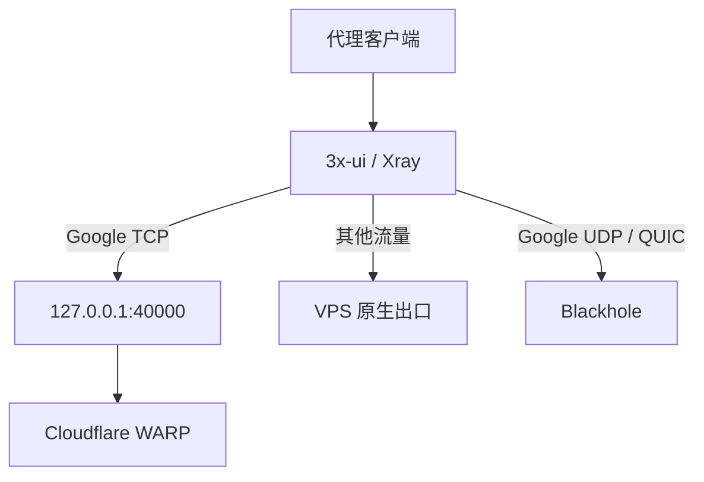

# Architecture

`warp-svc` 被固定在 Local Proxy 模式。系统默认路由不指向 WARP，因此 SSH、面板与未命中
Xray 规则的连接不受 WARP 状态影响。

## Trust boundaries

- Cloudflare 官方软件包：由 Cloudflare APT/YUM 仓库和 GPG key 提供。
- 本管理脚本：复制到 `/usr/local/sbin/warp3xui`。
- 非敏感运行参数：保存到权限 `0600` 的 `/etc/warp-3xui/config.env`。
- WARP 注册信息：由官方客户端管理，本项目不读取或导出私钥。
- 3x-ui：只生成示例，不直接修改数据库或 Xray 配置。

## Failure behavior

- `mode proxy` 失败时不会执行 `connect`。
- 首次安装在验收前出错，会调用 `warp-cli disconnect`。
- 更新管理脚本前运行 `bash -n` 并验证项目标识，旧版本保留为 `.bak`。
- WARP 代理异常不会改变系统默认路由，原生 SSH 不依赖 WARP。
